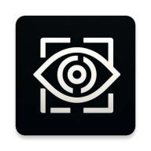

# LocumVisium Back-end


Locum Visium is a community-based social media Android app designed to help users discover popular local places and events near their position. 📍📱

## Overview 


[Overview Video](https://www.youtube.com/watch?v=UocxDTZqIPg&ab_channel=MSstudioHD)

## Features
- **Discover** Local Places and Events: Easily find popular local spots and events through user-generated content.
- **Share** Your Favorite Spots: Take and share pictures and text about your favorite places, increasing their visibility.
- **Interactive Map**: Posts are displayed on an interactive map using the Google Maps API, with clickable pins for easy exploration. 
- **Social Media Feed**: View posts in a social media-like scroll-feed, showcasing pictures and descriptions of local spots.

## Technologies
- **Android API 31**: application written in Java 
- **Google Maps API**: Used to display an interactive map with clickable pins. 
- **GoogleImagesSearch API**: To retrieve images for the mock data.
- Android Camera and GPS Integration
- **Backend Server**: Developed using Python with Flask.

   Here's the revised version of the installation and usage guide, with improved clarity and grammar:

## Python Flask Back-end  
[Back-end git](https://github.com/alessiogiovagnini/locusVisium-back-end )


## Installation 
### Set the server IP
Before running the application make sure it is pointing to the right server.
In case of local installation or usage set the server ip the file app/src/main/res/raw/config.properties
```text
host=SERVER_IP
```